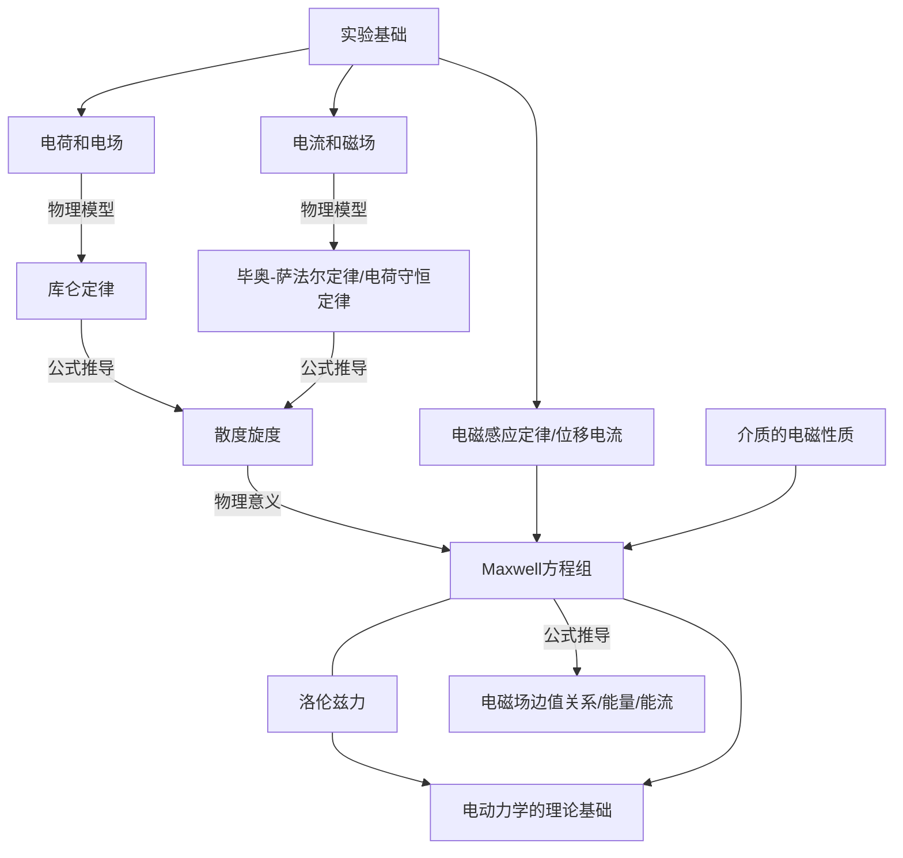

[TOC]
#### 一、学习计划
0. 笔记形式：Markdown（类似于LaTex）做文字PDF笔记，公式推导以及习题手写。
1. **《电动力学》 郭硕鸿**
周一到周六一天一小节课本内容以及对应的课后习题，周日总结反思，力争弄懂书本上的每一句话每一个公式，并能够推导书上的公式，能够对物理意义有深刻的认识。预计七～八周完成。
2. **《费恩曼物理学讲义》第二卷 中文版以及对应英文版**
在《电动力学》的学习过程中参考《费恩曼物理学讲义》相应的知识点，《费恩曼物理学讲义》对物理概念、物理意义的描述更细致也更生动，《电动力学》全书完成后我会再针对《费恩曼物理学讲义》英文版进行一遍系统的学习。
3. **《经典电动力学》 Jackson**
目前只有电子版的书，作为学习参考。
#### 二、第一周
##### （一）学习摘要
主要为《电动力学》第一章的内容。

##### （二）学习笔记以及要点
##### 1.1 电荷和电场
1. **场的概念，为什么不是超距作用？《电》p3 《L》1-5**
电磁场：物质存在的一种形态。通过实验测得了电磁波是有特定速度的，相对论中也说明了任何速度不能超过真空中的光速，有特定速度就说明了有能量损失，根据能量守恒，有能量损失就说明有物质的作用，从而说明了场的存在。而超距作用的基础是电磁力的传播速度是无穷大。
《电动力学》书中说的是如果是静电荷利用超距作用能够解释，而如果电荷发生讯变，超距作用无法解释实验现象。虽然没有详细说明，不过我认为作者说的“讯变”正是想说明电磁波具有特定速度，力的作用不会突变而是有一定的弛豫时间。
场中的物质又是什么？根据传播速度，应该是光子。
2. **推导电场强度通量的高斯定理**
* 通量
Flux=(average normal component)$\cdot$(surface area)
* 立体角$\Omega$概念
* 散度的定义
* 两种计算方法：

*勘误：课本1.5式中x未写成加粗的矢量样式*
高斯定理是库仑定律的必然结果，已在笔记本中用两种方法推导出高斯定理。
$$\oint \bold{E}\cdot dS=\frac{Q}{\varepsilon_0}$$
$$\nabla \cdot \bold{E}= \frac{\rho}{\varepsilon_0}$$
* 物理意义
微分式：电荷是电场的源。
3. **静电场的旋度**
* 计算静电场的旋度，为0只有在静电情况下成立。
同样两种方法，笔记本已推导
* 物理意义
微分式：在静电情形下电场没有漩涡状结构。
积分式：单位正电荷沿静电场中的任一闭合回路路径移动一周，电场力不做功。
##### 1.2 电流和磁场
1. 电荷守恒定律
* 电流密度的概念
* 电荷守恒定律的微分形式以及积分形式
* 全空间的总电荷守恒
* 恒定电流无源
3. 磁场的旋度以及散度
* 《电》中由无限长直导线作为特例推导出散度公式，由简入繁
* 磁场散度物理意义：磁感应强度是无源场
* 磁场旋度物理意义：恒定磁场是有旋场，恒定电流是产生恒定磁场的漩涡源
* 具体公式推导在笔记本中给出
##### 1.3 麦克斯韦方程组
1. 电磁感应定律
* 感应电场是有旋场
2. 位移电流
* 实质是电场的变化率
3. Maxwell方程组及其物理意义
* 电荷和电流可以激发电磁场，变化的电场和磁场也可以相互激发，电磁场互相激发而运动传播，预示了电磁波的存在。
$$\nabla \times \bold{E}= -\frac{\partial \bold{B}}{\partial t}$$
$$\nabla \times \bold{B} = \mu_0\bold{J}w+\mu_o\varepsilon_0\frac{\partial \bold{B}}{\partial t}$$
$$\nabla \cdot \bold{E}= \frac{\rho}{\varepsilon_0}$$
$$\nabla \cdot \bold{B}= 0$$
第一个式子表明时变磁场产生时变电场
第二个式子表明时变磁场不仅由传导电流产生，也有位移电流产生，时变电场产生时变磁场。
第三个式子表明电荷是电场的源并且电场线从正电荷发出终止于负电荷。
第四个式子表明磁通永远连续且磁场是无散度场。
4. 洛伦兹力
* 公式
##### 1.4 介质的电磁性质
* 介质极化
* 介质磁化
* 本构关系
##### 1.5 电磁场边值关系
* Maxwell的微分形式适用于连续的介质内部，介质分界面两边的场量会发生跃变，因而微分形式不再适用，利用Maxwell方程组的积分形式可以求出电磁场的边值关系，推导过程在笔记本中。
##### 1.6 电磁场的能量和能流密度
*勘误：6.6式中的最后一个$\bold{E}$应该改为$\bold{H}$*
* 能流密度，能量密度的概念以及推导
* 恒定情况下的电磁能量传输问题
##### （三）课后习题
* 1.1-1.3
习题1-3为$\nabla$算符的计算，要点：$\nabla$算符的矢量性以及微分性，掌握课本附录中的$\nabla$算符公式以及推导过程
课后习题1.3中$\nabla'$的定义与《费》中的定义不同
《电》：$\nabla'$为对源点$x'$求微商,结论：$\nabla'$等价$-\nabla$
《费》：$\nabla'\cdot \bold{h}=\frac{\partial h_{x'}}{\partial x'}+\frac{\partial h_{y'}}{\partial y'}+\frac{\partial h_{z'}}{\partial z'}$结论：$\nabla'$等价$\nabla$
* 其他题目重点是对本章公式以及概念的熟悉。
* 散度旋度
散度：矢量场的发散程度，大于0表示有流量流出，为发散源，小于0表示汇聚源。
旋度：矢量场在某点漩涡强度的量度。
掌握意义以及积分式与微分式的转化。
参考：黄国良, 王瑞平. 矢量场散度和旋度的物理意义[J]. 西安科技大学学报, 1993(1):71-77.
#### 三、第二周
##### （一）学习摘要
主要为《电动力学》第二章的内容，
##### 1.1 静电场的标势及其微分方程
* 静电场无旋的解释
* 电势的概念
* 回顾下第一章中的概念.$\nabla$的概念以及其微分积分的转化。
$$\nabla \times \nabla\cdot\varphi= 0$$
* （1.7）式只能反映电荷激发电场这一方面，而没有反映场对电荷作用的结果。
* 泊松方程
* 导体的静电条件
* 静电场能量：
一个化简积分的方法：
$\varphi\backsim \frac{1}{r}$
$D\backsim\frac{1}{r^2}$
$S\backsim r^2$
所以当$r\to \infty$积分式$\oint_s\varphi \bold{D}\cdot d\bold{S}=0$
注意静电场能量和非静电场能量的区分以及为什么
* 三个例题，尝试用不同方法（高斯定理）解决。
* 习题1.1 1.2
##### 1.2 唯一性定理
* 证明静电问题以及有导体问题的唯一性定理
* 理解唯一性定理
* 例题： 导体两半球面上的自由电荷分布是不同的，但**E**却保持球对称性，试解释。